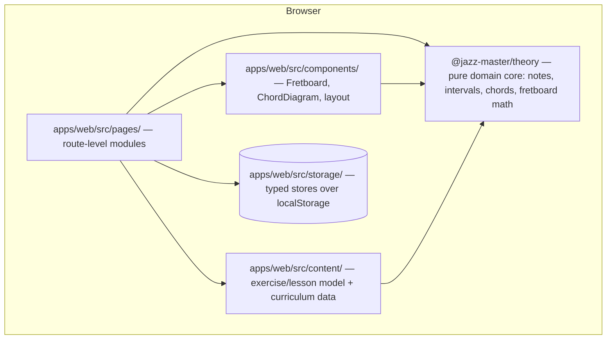

# Architecture overview

Living document — update it whenever the shape of the system changes. Decisions with lasting consequences get an ADR in `decisions/`; notable events go to `LOG.md`.

## System shape

Jazz Master is a local-first single-page app. No backend, no accounts: all state lives in the browser (localStorage), all logic runs client-side. See ADR-002.



## Layers and rules

| Layer | Path | Rule |
|---|---|---|
| Domain core | `codebase/packages/theory/` | `@jazz-master/theory` — pure TypeScript, **zero runtime dependencies in its `package.json`** (no React, no DOM, no side effects — structurally enforced). Exhaustively unit-tested — enharmonic spelling correctness is non-negotiable. |
| Components | `codebase/apps/web/src/components/` | Reusable, thin; music knowledge comes from `@jazz-master/theory`, never inlined. |
| Pages | `codebase/apps/web/src/pages/` | One per practice module; own their route, compose components. |
| Content | `codebase/apps/web/src/content/` | Exercise/lesson types, resolver, validator, and hand-authored lesson data. Pure TS — references theory constructs, never hard-coded note lists; imports `@jazz-master/theory` only (no components, no React, no storage). |
| Persistence | `codebase/apps/web/src/storage/` | Typed stores over localStorage via `defineStore` — **no direct `localStorage` access outside this directory**. The seam where a backend would replace the implementation (ADR-002). |

Dependency direction: `pages → components → @jazz-master/theory` and `pages → content → @jazz-master/theory` (consumed as `workspace:*`). Nothing imports upward; `theory` imports nothing of ours.

## Repository layout (ADR-005, landed with TASK-027)

The repo root holds only the knowledge system (strategy/processes/work/notes/research/architecture/artifacts) — **no `package.json` at the root** (owner decision during TASK-027; ADR-005's original root-shim idea is amended there). All code lives under `codebase/`, a Bun-workspaces monorepo:

```
codebase/
  package.json          # workspace root: apps/*, packages/*; lockfile + node_modules here
  tsconfig.base.json    # shared compiler options; per-workspace tsconfigs extend it
  vitest.config.ts      # test.projects: all workspaces run from one `bun run test`
  packages/theory/      # @jazz-master/theory — the pure domain core, zero runtime deps
  apps/web/             # the app (later the Astro shell, TASK-021)
```

Future apps (CLI, docs, presentations) are added as `apps/*` directories. Package extraction requires a second concrete consumer or provable purity; `packages/ui`, `packages/storage`, and `packages/config` are deferred with triggers recorded in ADR-005. All bun commands run from `codebase/` — from the repo root use `bun run --cwd codebase <script>`.

## Toolchain

Bun (runtime, packages, workspaces) · Vite 8 (build) · React 19 · TypeScript (project references: `apps/web` → `packages/theory`, which is `composite` and emits declarations only) · Tailwind v4 (CSS-config via `@theme`, scoped to `apps/web`) · Vitest + Testing Library (jsdom in `apps/web`; node defaults in packages) · oxlint. See ADR-001. The single verification gate is `bun run check` (run in `codebase/`).

## Knowledge system

The repo is also the product operating system. `strategy/` sets direction, `processes/` defines executable playbooks, `work/` tracks lifecycle-managed epics/tasks/insights/issues/reviews, `notes/` preserves raw feedback and observations, `research/` stores completed research, `architecture/` records system shape and decisions, and `artifacts/` stores human-facing rendered outputs such as presentations and visual reports. `wiki/` is a derived layer on top: compiled "how the product/project works" pages that cite the canonical files and lose to them on conflict (ADR-007; ops in `processes/wiki-maintenance.md`). Markdown files remain the canonical source for agent-facing instructions and project knowledge. See ADR-003 and ADR-004.

## Routing

react-router v8, library mode. `BrowserRouter` wraps `App` in `apps/web/src/main.tsx`; `App.tsx` owns the route table (a `Layout` route with nested children per practice module, plus a `*` → `NotFoundPage` catch-all). `apps/web/src/components/Layout.tsx` is the persistent shell (sidebar nav via `NavLink`, content via `<Outlet>`). Tests mount `App` in a `MemoryRouter`.

## Theory core

`codebase/packages/theory/src/` — `note.ts` (Note = letter + accidental, parse/format/pitch class), `interval.ts` (named-interval table; `transpose` moves the letter then derives the accidental, so spelling is correct by construction), `chord.ts` (formulas as interval stacks; `spellChord`, `parseChord`). Public API is the `index.ts` barrel only; parse functions return `null` on bad input, `spellChord` throws on a bad root string (programmer error). Names beyond double accidentals are unrepresentable — `noteName` throws.

## Persistence (TASK-008)

`apps/web/src/storage/` exposes `defineStore<T>({ name, version, defaultValue, migrate? })`, returning a typed `Store<T>` (`get`/`set`/`update`/`reset`). Values persist under `jazz-master:<name>` in a `{ version, data }` envelope. Reads never throw: missing keys, corrupt JSON, malformed envelopes, versions from the future, and failed migrations all fall back to `defaultValue()` with a `console.warn`. When the persisted version is older, `migrate(persisted, fromVersion)` upgrades the data and the result is written back. **Convention: no direct `localStorage` access outside `src/storage/`** — every feature defines a store, so a backend can later replace the wrapper (ADR-002). Extraction to `packages/storage` waits for a second consumer (ADR-005); React hooks over stores are deferred to first use.

## Content model (TASK-011)

`apps/web/src/content/` is the shared contract between curriculum data (TASK-012), the practice runner (TASK-013), and the planner (EPIC-011). An `Exercise` is one playable unit — `ExerciseMaterial` (a discriminated union referencing theory constructs: scale or arpeggio + root + type/quality; more kinds arrive with the tasks that need them), a fret `window` (the position), `tempoBpm`, a `duration` (minutes or repetitions), and `display` hints. A `Lesson` is ordered exercises plus planner metadata: `area` (`scales | arpeggios | chords | standards`), `level` (1 = beginner), `prerequisites` (lesson ids), `estimatedMinutes`. `resolveExercise` turns a reference into concrete spelled notes + `PositionedNote[]` (throws on broken references); `validateLessons` returns a problem list covering unparseable roots, invalid windows, non-positive amounts, duplicate ids, and missing/cyclic prerequisites — lesson packs assert it returns `[]` in a test.

## Current state (2026-07-06)

App shell done (TASK-001): routing + sidebar nav + stub pages. Theory core done (TASK-002, TASK-009, TASK-010): notes, intervals, chord spelling/parsing, scales/modes/arpeggios, fretboard positions, 12-key test coverage. Fretboard (TASK-003) and chord diagrams (TASK-004) done. Monorepo restructure done (TASK-027, per ADR-005): code lives under `codebase/` as `apps/web` + `packages/theory`. Persistence layer done (TASK-008): typed localStorage stores — this completes EPIC-001. Exercise/lesson content model done (TASK-011): `apps/web/src/content/` opens EPIC-008. First lesson pack done (TASK-012): 10 scales/arpeggios lessons across 3 levels in `apps/web/src/content/lessons.ts`, listed on the Practice page. Next: the EPIC-013 platform track (ADR-006 / TASK-020 onward) and the rest of the guided-practice slice (TASK-013, EPIC-011/012).
