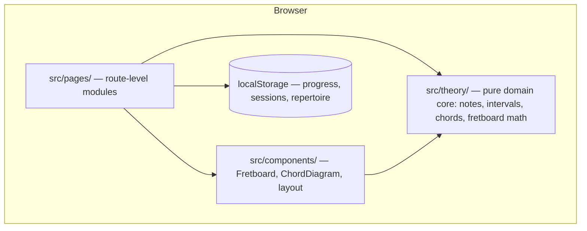

# Architecture overview

Living document — update it whenever the shape of the system changes. Decisions with lasting consequences get an ADR in `decisions/`; notable events go to `LOG.md`.

## System shape

Jazz Master is a local-first single-page app. No backend, no accounts: all state lives in the browser (localStorage), all logic runs client-side. See ADR-002.

## Layers and rules

| Layer | Path | Rule |
|---|---|---|
| Domain core | `src/theory/` | Pure TypeScript. **No React, no DOM, no side effects.** Exhaustively unit-tested — enharmonic spelling correctness is non-negotiable. |
| Components | `src/components/` | Reusable, thin; music knowledge comes from `theory/`, never inlined. |
| Pages | `src/pages/` | One per practice module; own their route, compose components. |
| Persistence | (planned, EPIC-001) | localStorage behind a typed wrapper so a real backend can replace it later. |

Dependency direction: `pages → components → theory`. Nothing imports upward; `theory` imports nothing of ours.

## Toolchain

Bun (runtime, packages) · Vite 8 (build) · React 19 · TypeScript · Tailwind v4 (CSS-config via `@theme`) · Vitest + Testing Library (jsdom) · oxlint. See ADR-001. The single verification gate is `bun run check`.

## Knowledge system

The repo is also the product operating system. `strategy/` sets direction, `processes/` defines executable playbooks, `work/` tracks lifecycle-managed epics/tasks/insights/issues/reviews, `notes/` preserves raw feedback and observations, `research/` stores completed research, `architecture/` records system shape and decisions, and `artifacts/` stores human-facing rendered outputs such as presentations and visual reports. Markdown files remain the canonical source for agent-facing instructions and project knowledge. See ADR-003 and ADR-004.

## Routing

react-router v8, library mode. `BrowserRouter` wraps `App` in `src/main.tsx`; `App.tsx` owns the route table (a `Layout` route with nested children per practice module, plus a `*` → `NotFoundPage` catch-all). `src/components/Layout.tsx` is the persistent shell (sidebar nav via `NavLink`, content via `<Outlet>`). Tests mount `App` in a `MemoryRouter`.

## Theory core

`src/theory/` — `note.ts` (Note = letter + accidental, parse/format/pitch class), `interval.ts` (named-interval table; `transpose` moves the letter then derives the accidental, so spelling is correct by construction), `chord.ts` (formulas as interval stacks; `spellChord`, `parseChord`). Public API is the `index.ts` barrel only; parse functions return `null` on bad input, `spellChord` throws on a bad root string (programmer error). Names beyond double accidentals are unrepresentable — `noteName` throws.

## Current state (2026-07-05)

App shell done (TASK-001): routing + sidebar nav + stub pages under `src/pages/`. Theory core done (TASK-002): notes, intervals, chord spelling/parsing for maj7 · 7 · m7 · m7b5 · dim7 · 6 · m6, 12-key test coverage. Fretboard (TASK-003), chord diagrams (TASK-004), and persistence are next.
