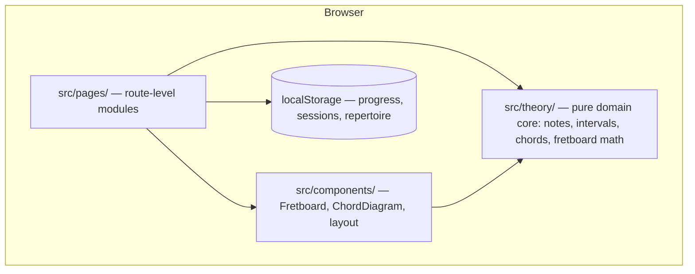

# Architecture overview

Living document — update it whenever the shape of the system changes. Decisions with lasting consequences get an ADR in `decisions/`; notable events go to `LOG.md`.

## System shape

Jazz Master is a local-first single-page app. No backend, no accounts: all state lives in the browser (localStorage), all logic runs client-side. See ADR-002.

## Layers and rules

| Layer | Path | Rule |
|---|---|---|
| Domain core | `src/theory/` | Pure TypeScript. **No React, no DOM, no side effects.** Exhaustively unit-tested — enharmonic spelling correctness is non-negotiable. |
| Components | `src/components/` | Reusable, thin; music knowledge comes from `theory/`, never inlined. |
| Pages | `src/pages/` | One per practice module; own their route, compose components. |
| Persistence | (planned, EPIC-001) | localStorage behind a typed wrapper so a real backend can replace it later. |

Dependency direction: `pages → components → theory`. Nothing imports upward; `theory` imports nothing of ours.

## Toolchain

Bun (runtime, packages) · Vite 8 (build) · React 19 · TypeScript · Tailwind v4 (CSS-config via `@theme`) · Vitest + Testing Library (jsdom) · oxlint. See ADR-001. The single verification gate is `bun run check`.

## Current state (2026-07-05)

Scaffold only: app shell placeholder in `src/App.tsx`, one smoke test. The layers above are the *intended* shape; EPIC-001 tasks (TASK-001..004) build them.
