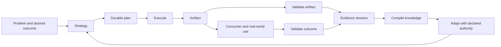

# Adaptive Problem-Solving Systems

Adaptive Problem-Solving Systems (APSS) is a domain-independent framework for
designing systems that repeatedly solve a defined problem, produce an artifact,
verify both the artifact and its real-world effect, preserve evidence, compile
reusable knowledge, and improve how they operate.

APSS applies to software delivery, organizations, research, mathematics,
manufacturing, personal workflows, and systems whose job is to improve other
problem-solving systems. It specifies the responsibilities that close the loop;
it does not prescribe one workflow, storage technology, cadence, or management
method.

This package is a framework specification, not yet an APSS instance. A future
version may operate APSS itself as an adaptive system. Changes to this package
are summarized in [CHANGELOG.md](CHANGELOG.md).

## Why APSS exists

Many efforts define a goal and an execution process but leave the feedback loop
implicit. They may produce outputs without checking whether those outputs solve
the consumer's problem; collect observations without compiling them; or write
lessons without changing the next plan. The result is activity that repeats
without becoming more effective.

APSS makes the complete loop explicit and inspectable:



The phases are responsibilities, not a mandatory sequence. A system may run
them synchronously, asynchronously, continuously, on events, on a schedule, in
parallel, or in another problem-appropriate arrangement. Its current arrangement
is part of its strategy and may itself evolve.

## Core definitions

### Problem, vision, goal, and strategy

- **Problem** — the condition the system exists to change, including the
  affected consumer or environment.
- **Vision** — the durable description of what better looks like if the problem
  is solved.
- **Goal** — a current, bounded result that moves the system toward its vision.
- **Strategy** — the system's current theory and approach for reaching its
  goals: how it plans, executes, validates, learns, and coordinates its
  subsystems. Strategy is allowed to change when evidence warrants it.

### System and subsystem

An **adaptive problem-solving system** owns:

1. a distinct problem and boundary;
2. stable identity and lifecycle ownership;
3. roles and adaptation authority;
4. inputs, constraints, and evidence streams;
5. a strategy and durable plan;
6. a complete execution and feedback loop;
7. at least one primary artifact;
8. a consumer and intended outcome;
9. separate artifact and outcome validation;
10. compiled knowledge and a process that produces it; and
11. an adaptation process that changes future operation.

A **subsystem** is a system whose lifecycle is owned by exactly one parent
system. It still owns its complete adaptive loop. If an entity cannot justify
its own artifact, outcome, evidence, learning, and adaptation, model it as a
**process** or **capability** inside its parent instead of inventing a hollow
subsystem.

### Artifact and outcome

An **artifact** is an inspectable output produced by a system. It may be:

- digital, such as code or a deployed application;
- informational, such as a wiki, plan, research report, or test result;
- decisional, such as an approved strategy or design;
- formal, such as a mathematical proof;
- physical, such as a CNC-machined part; or
- a recorded state transition, such as a reconciled database or restored
  operating condition.

The **outcome** is the change the artifact should cause for its consumer or
environment. Artifact and outcome must not be conflated: a part may match its
CAD tolerances and still fail in use; software may pass every test and still not
help its user.

### Stream, raw evidence, and compiled knowledge

- An **information stream** is a source of observations relevant to the system:
  work logs, meetings, customer threads, runtime logs, test results, feedback,
  research, experiments, or another system's artifacts.
- **Raw evidence** is source material kept recoverable whenever possible. It may
  be copied into the system or referenced in an external system of record.
- **Compiled knowledge** is a reusable synthesis derived from evidence: a wiki,
  playbook, model, set of heuristics, or another knowledge artifact.

Raw evidence remains available because a later strategy or question may make a
previously ignored detail important. Compiled knowledge is therefore revisable
and, where useful, reproducible from old and new evidence. Repository-backed
systems can rely on git for detailed provenance; the compiled artifact needs a
simple changelog, not a duplicate manifest for every compilation.

## The complete adaptive loop

Every APSS instance must implement all of these responsibilities. Their exact
ordering, cadence, concurrency, tooling, and resource budget belong to the
system's strategy.

### 1. Orient and frame

Read the current problem, vision, goals, constraints, parent direction, relevant
compiled knowledge, and new evidence. Confirm that the system is still solving
the right problem.

### 2. Plan

Choose the next work and record a durable plan. Every system keeps a work log so
execution can resume across time, people, or agents. APSS recommends common
work types—task, issue, insight, question, decision, research, and experiment—
but does not force a taxonomy.

### 3. Resolve uncertainty

The system may invoke three general evidence-producing capabilities, using
domain-specific protocols:

- **Discussion / grilling** — elicit knowledge, context, trade-offs, or judgment
  from a person or agent. Asynchronous meetings and customer threads qualify;
  their durable summary becomes an evidence stream.
- **Research** — find and synthesize existing external knowledge.
- **Experimentation** — generate new evidence through prototypes, user trials,
  simulations, benchmarks, feasibility work, formal proof, theorem proving, or
  another deliberate test.

These capabilities may be implemented locally or delegated to shared systems.
The system declaration states how they are invoked and any system-specific
protocol, such as a particular grill.

### 4. Execute and produce

Run the system's process and produce the primary artifact plus any supporting
artifacts. Record material decisions, deviations, failures, and successful
resolutions in the work log.

### 5. Validate the artifact

Verify that the output satisfies its specification or acceptance conditions.
The method depends on the problem: tests, inspection, review, proof checking,
measurement, tolerance analysis, or another fit-for-purpose check.

### 6. Validate the outcome

Verify separately that the artifact caused the intended effect for its consumer
or environment. Outcome validation may require observation over time and may be
asynchronous with artifact validation.

### 7. Capture evidence

Preserve relevant raw observations and provenance through declared streams. Do
not turn missing information into fact. If a stream lacks context, record the
gap and invoke discussion, research, or experimentation when the answer is
load-bearing.

### 8. Compile knowledge

Run the system's implemented compilation process. The system decides when to
run it, what evidence to revisit, whether to update incrementally or recompile
more broadly, and how to allocate time, compute, token, or human attention.

### 9. Adapt

Use validated learning to improve the plan, strategy, processes, streams,
validation, knowledge, or subsystem structure. Adaptation follows the authority
declared by the system. The initial safe default is human approval by the
responsible owner; trusted systems may later receive bounded autonomous
authority.

### 10. Continue, stop, or hand off

Trigger the next invocation, wait for an event or schedule, hand an artifact to
another system, or end when the problem is solved. Open-ended systems continue
while their purpose remains valid.

## Validation has two mandatory dimensions

Every system declares both dimensions even if they run at different times.

| Dimension | Question | Typical evidence |
|---|---|---|
| Artifact correctness | Did we produce the output correctly? | tests, review, inspection, proof, measurements |
| Outcome effectiveness | Did the output solve the consumer's problem? | use, behavior, feedback, field results, longitudinal measures |

An open-ended or continuously operating system may additionally define
**health/homeostasis** conditions: viability constraints it must maintain while
pursuing outcomes, such as cash flow, safety margin, latency, capacity, or error
rate. Health is an optional pattern, not a universal third validation field.

## Hierarchy, ownership, and relationships

Every system has one stable ID independent of its path. A root has no parent;
every subsystem has exactly one primary parent. The parent owns the subsystem's
lifecycle: creation, placement, resource boundary, escalation, and retirement.

Systems may participate across the hierarchy through typed relationships. APSS
does not close the vocabulary, but common relations include:

- `feeds` — provides evidence or artifacts to another system;
- `verifies` / `verified_by` — validates another system or is validated by it;
- `invokes` — calls another system or capability;
- `depends_on` — requires another system's result;
- `scheduled_by` — receives its invocation from another system;
- `governed_by` — operates under another system's authority; and
- `improves` — adapts another declared target with permission.

The primary-parent hierarchy answers “who owns this?” Typed relations answer
“where else does this participate?” This keeps filesystem placement and
authority unambiguous without pretending the organization is only a tree.

## Roles and authority

Every system declares:

- **owner** — accountable for the system's purpose and lifecycle;
- **operators** — execute the loop;
- **artifact consumers** — use the primary artifact;
- **validators** — judge artifact correctness and outcome effectiveness; and
- **adaptation approvers** — authorize changes to strategy or operation.

The same person or agent may hold multiple roles. Authority is explicit rather
than inferred. A system can be human-operated, agent-operated, automated, or a
mixture. Autonomy is a declared permission earned through evidence, not an
assumption implied by automation.

## Standard system capsule

Concrete APSS instances live under `systems/`. System-owned material is
colocated; shared or external evidence is referenced as a stream.

```text
systems/
  <root-system>/
    SYSTEM.md
    processes/
    streams/
    work/
      PLAN.md
      LOG.md
    validation/
    knowledge/
      README.md
      CHANGELOG.md
    subsystems/
      <child-system>/
        SYSTEM.md
        ...
```

Only `SYSTEM.md`, a durable plan, a work log, an execution process, a
compilation process, validation definitions, and a compiled-knowledge artifact
are conceptually required. They may share files when that is clearer. Empty
ceremonial directories add no value.

Child systems are physically nested under the owning parent's `subsystems/`
directory. Cross-system relations use stable IDs, not copied folders or
duplicate definitions.

## Lightweight stream declarations

Streams are heterogeneous, so APSS standardizes only a small interface:

```yaml
streams:
  - id: customer-discussions
    purpose: Learn where the current workflow creates friction.
    source: Async customer discussion threads.
    access: External system reference or retained summary.
    consumed_by: processes/compile-product-knowledge.md
    grill: processes/customer-feedback-grill.md
```

Systems may add retention, privacy, schema, normalization, or reliability fields
when their problem requires them. They are not universal framework ceremony.

## Creating a system

1. **Establish the boundary.** Name the distinct problem, consumer, outcome,
   artifact, owner, and why this requires an independent adaptive loop rather
   than a process inside another system.
2. **Choose identity and ownership.** Assign a stable ID, select exactly one
   parent, create the capsule under that parent's `subsystems/`, and declare
   cross-system relationships.
3. **Declare direction.** Write the vision, current goals, constraints, and
   current strategy.
4. **Declare roles and authority.** Name operators, consumers, validators, and
   adaptation approvers. Start human-approved unless autonomy is deliberate and
   justified.
5. **Declare artifacts and validations.** State the primary artifact,
   acceptance method, intended outcome, and outcome-validation method.
6. **Declare streams and uncertainty routes.** Name the evidence sources and
   how discussion, research, and experimentation are invoked.
7. **Implement the full loop.** Add durable planning/work logging, execution,
   both validations, compilation, adaptation, and continuation/termination.
8. **Create compiled memory.** Give the system a knowledge artifact and simple
   changelog.
9. **Visualize and inspect.** Generate or draw the hierarchy, artifact flow,
   and learning loop from the declaration; fix missing ownership or dead ends.
10. **Run it once end to end.** A declared loop that has never produced,
    validated, learned, and adapted is a design hypothesis, not yet a proven
    adaptive system.

The normative structural contract is
[system.schema.json](system.schema.json), explained in
[SCHEMA.md](SCHEMA.md). Start from
[SYSTEM.template.md](SYSTEM.template.md). A complete physical-domain
example lives at [examples/cnc-part-production/SYSTEM.md](examples/cnc-part-production/SYSTEM.md).

## Assessing an existing system

An existing system conforms when a reviewer can answer all of these from its
capsule and referenced sources:

- What problem, vision, and current goal does it own?
- Who owns, operates, consumes, validates, and approves adaptation?
- What is its primary artifact and intended outcome?
- How does it plan and retain a work log?
- What is the complete execution/feedback loop?
- How are artifact and outcome validated separately?
- Which evidence streams does it consume and produce?
- How can it invoke discussion, research, and experimentation?
- Where is compiled knowledge, and how is it compiled?
- How does learning change future operation?
- Which parent owns it, and what cross-system relations exist?
- If it is open-ended, does it need health/homeostasis conditions?

Missing answers are explicit design gaps. Do not invent a subsystem merely to
fill a diagram: either implement its full adaptive loop or keep the behavior as
a process/capability inside an accountable parent.

## Visual orientation

APSS uses three complementary projections rather than one overloaded graph:

1. hierarchy and ownership;
2. artifact flow from producer to consumer; and
3. evidence, compilation, and adaptation flow.

The maps should be generated from `SYSTEM.md` declarations where practical.
Manual maps are derived navigation aids and must lose to the declarations on
conflict. Detailed conventions and examples are in
[VISUALIZATION.md](VISUALIZATION.md).

## What APSS deliberately does not standardize

APSS does not require a particular project-management method, database, wiki
tool, communication platform, orchestration engine, schedule, work taxonomy,
compilation algorithm, experiment type, or validation technique. Those are
strategy decisions made by each system in response to its problem, constraints,
and available resources.

The framework standardizes the questions that make a problem-solving loop
complete, observable, improvable, and accountable.
