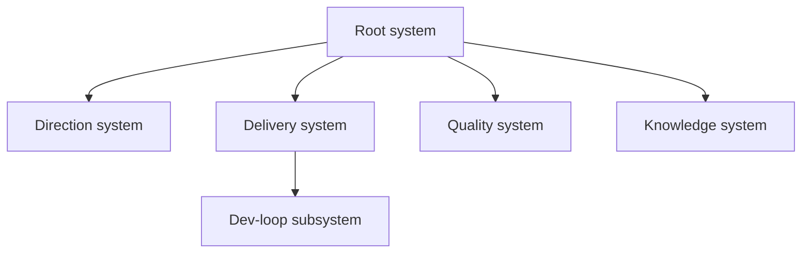
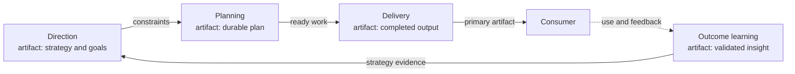
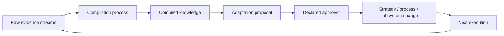
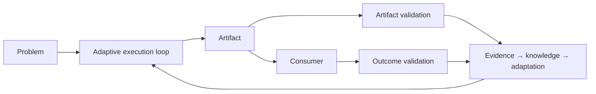

# Visualizing APSS

System declarations are the source of truth. Visualizations are derived
projections for orientation, diagnosis, and improvement. Generate them from
`SYSTEM.md` frontmatter where practical; if maintained manually, correct them
whenever they conflict with declarations.

No single diagram should show every relationship. APSS uses three standard
views plus a repeatable local-system motif.

## 1. Hierarchy and ownership

Purpose: answer “what systems exist, where do they belong, and who owns their
lifecycle?”

Use only `parent` edges. Keep the first view to roughly six to eight top-level
systems, then allow readers to zoom into a selected branch.

Node labels should contain the system name. Detail views may add the primary
artifact; do not fill the orientation map with goals, streams, and metrics.

## 2. Artifact flow

Purpose: answer “how does the larger problem become useful output, and who
consumes each step?”

Use producer-to-consumer edges labeled with the artifact. Include outcome
feedback when it materially closes the loop.

This is the recommended default orientation view because it shows why each
system exists, not only where it is stored.

## 3. Evidence, compilation, and adaptation

Purpose: answer “how does this system learn, and where does that learning
change future operation?”

Show raw streams, compilation, knowledge artifacts, adaptation authority, and
the target process or strategy. Use it during maintenance and redesign rather
than as the first view for newcomers.

## Local-system motif

Every system can be understood through the same compact model:

## Generation contract

A generator can derive the views from these declaration fields. It should use
the normative [system schema](system.schema.json) rather than maintaining a
second required-field list:

| View | Fields |
|---|---|
| Hierarchy | `id`, `name`, `parent`, `status` |
| Artifact flow | `artifact.primary`, `artifact.consumers`, `relations.feeds` |
| Learning | `streams`, `learning.*`, `authority.adaptation`, `relations.improves` |

It should also report structural problems:

- duplicate IDs;
- missing parents or relation targets;
- parent cycles;
- active systems missing required APSS fields;
- artifacts without consumers or intended outcomes;
- missing artifact or outcome validation;
- missing durable plan/work log;
- missing compilation or adaptation processes; and
- declarations that reference nonexistent local files.

The generated output is disposable. Never edit generated maps as if they were
the system definition.

## Visual discipline

- Start with the smallest useful view; reveal detail by branch or system.
- Use stable system names and artifact labels, not folder paths, as visible text.
- Pair edge labels with line styles; do not rely on color alone.
- Keep lifecycle ownership (`parent`) visually distinct from artifact, evidence,
  and governance relationships.
- Show unresolved or proposed systems explicitly rather than presenting them as
  active.
- A diagram with no consumer, validation, or feedback edge is a prompt to check
  whether the declared loop is actually closed.
