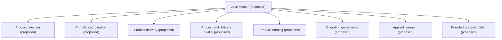
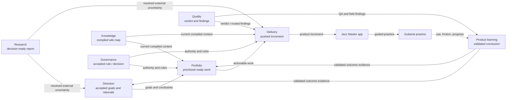
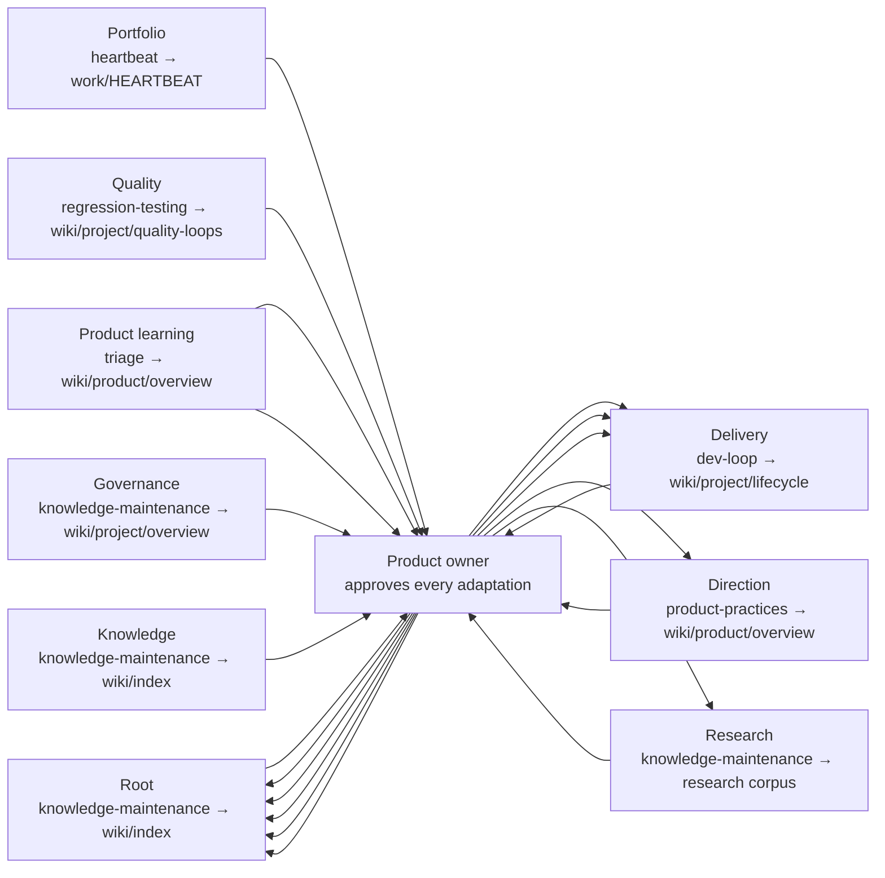

# Jazz Master APSS map

Status: **proposed and provisional**. This map is derived from the nine
`SYSTEM.md` declarations below. The current canonical paths in `strategy/`,
`processes/`, `architecture/`, `work/`, `notes/`, `research/`, `wiki/`, and
`artifacts/` have not moved. On conflict, a declaration controls this proposed
map and the current canonical file controls present-day operation.

Framework source: the sibling checkout at
`../adaptive-problem-solving-systems/artifacts/framework/` (APSS 0.1), with the
public repository as fallback. Scope source: TASK-077, ADR-013, and NOTE-015.

## Declaration register

| ID | Parent | Primary artifact | Intended consumer outcome | State |
|---|---|---|---|---|
| `jazz-master` | root | Usable Jazz Master web application | Guitarists practice more consistently, with less planning friction and measurable improvement | Proposed; outcome validation and root compilation incomplete |
| `jazz-master.direction` | `jazz-master` | Owner-approved direction packet | Effort targets the highest-value validated practice outcomes | Proposed; bet-to-outcome learning missing |
| `jazz-master.portfolio` | `jazz-master` | Prioritized resumable portfolio and heartbeat recommendation | Effort starts useful work without avoidable blockage or neglected hygiene | Proposed; selection-effectiveness learning missing |
| `jazz-master.delivery` | `jazz-master` | Pushed product/operating increment with synchronized record | Accepted work becomes usable capability safely and predictably | Proposed; cross-task dev-loop learning missing |
| `jazz-master.quality` | `jazz-master` | Reproducible quality verdict with routed findings | Defects, unsafe behavior, and regressions are prevented or exposed | Proposed; testing-system learning and outcome thresholds missing |
| `jazz-master.product-learning` | `jazz-master` | Validated traceable product-learning conclusion | Direction/work responds to real guitarist problems and effects | Proposed; external validation and learning-to-outcome trace missing |
| `jazz-master.governance` | `jazz-master` | Accepted traceable operating decision or rule | Agents remain consistent and the owner retains understanding/authority | Proposed; rule-effectiveness and owner-comprehension evidence incomplete |
| `jazz-master.research` | `jazz-master` | Cited decision-ready RES report | Consumers resolve important unknowns without rediscovery | Proposed; corpus-level effectiveness learning missing |
| `jazz-master.knowledge` | `jazz-master` | Current source-linked compiled wiki map | Operators orient with less re-derivation and fewer stale-context errors | Proposed; outcome validation missing |

Every declaration supplies APSS identity, one parent, problem, vision/goals,
roles, strategy, inputs, primary/supporting artifacts, consumer outcome,
planning/log, execution, both validation dimensions, streams, uncertainty
routes, compilation, adaptation, authority, and relations. A `proposed` system
may name an intended responsibility while explicitly marking its current
implementation as partial or a gap; none is represented as active.

## View 1 — hierarchy and lifecycle ownership

Rendering: **manually rendered from `id`, `name`, and `parent` fields** and
checked against the semantic registry validation. Only parent edges appear.

The flat eight-child root is deliberate but provisional. It preserves direct
root lifecycle ownership for independent quality and cross-cutting systems
without creating multiple parents. Typed relations carry scheduling,
verification, governance, and evidence participation.

## View 2 — artifact flow

Rendering: **manually rendered from `artifact.*`, `relations.feeds`,
`relations.verifies`, and `relations.governed_by`**. The diagram selects the
main product path for readability; the table beneath it is the exhaustive
declaration projection. Dashed arrows are consumer/outcome evidence rather than
lifecycle ownership.

| Producer | Declared artifact consumers | All declared `feeds` targets |
|---|---|---|
| `jazz-master` | Intermediate guitarists; product owner | None |
| `jazz-master.direction` | Portfolio; root | Portfolio; root |
| `jazz-master.portfolio` | Delivery; product owner; all children | Delivery; root |
| `jazz-master.delivery` | Users; product owner; product learning | Root; product learning; knowledge |
| `jazz-master.quality` | Delivery; portfolio; product owner | Delivery; portfolio; product learning |
| `jazz-master.product-learning` | Direction; portfolio; root | Direction; portfolio; quality; root |
| `jazz-master.governance` | All systems and future agents | Root; knowledge |
| `jazz-master.research` | All systems; product owner | Direction; portfolio; delivery; quality; product learning; governance; knowledge; root |
| `jazz-master.knowledge` | All systems; product owner; future agents | Direction; portfolio; delivery; quality; product learning; governance; research; root |

The core gap is visible in the dashed return from guitarist practice: current
owner dogfooding and episodic QA do not yet provide the repeated target-user or
longitudinal outcome evidence needed by the root and direction systems.

## View 3 — evidence, compilation, and adaptation

Rendering: **manually rendered from each declaration's `streams`, `learning.*`,
`authority.adaptation`, and `relations.improves` fields**. Every system appears
with its declared compiler and compiled artifact; arrows are the complete
`improves` projection, plus a self-loop where the declaration names only local
adaptation. All adaptation passes through the product owner.

| System | Declared streams (summary) | Compiler → compiled artifact | Declared adaptation target |
|---|---|---|---|
| Root | Product/practice; delivery/quality | knowledge maintenance → wiki index | Local/root strategy; no cross-system `improves` target |
| Direction | Product learning; feasibility/context | product practices → product overview | Root |
| Portfolio | Work state; owner/system demand | heartbeat → heartbeat record | Delivery |
| Delivery | Work/code; verification/review | dev loop → lifecycle-of-a-change | Local delivery; no cross-system target |
| Quality | Change; field/regression | regression testing → quality-loops | Delivery |
| Product learning | Raw product evidence; disposition/outcomes | triage → product overview | Direction; root |
| Governance | Decisions/authority; adherence/failures | knowledge maintenance → project overview | Root |
| Research | Demand; external evidence; disposition | knowledge maintenance → research corpus | Local research; no cross-system target |
| Knowledge | Canonical knowledge; use/drift | knowledge maintenance → wiki index | Root |

The graph shows the intended common motif, not a claim that every loop is
implemented. Knowledge compilation is strongest today; dev-loop, testing,
direction, coordination, governance, research, and product-outcome compilation
remain explicit gaps below.

## System boundaries and capability decisions

| Candidate | Decision | Rationale |
|---|---|---|
| Product direction | Independent proposed system | Owns owner-approved value/direction artifact and a product-outcome learning loop distinct from sequencing |
| Portfolio planning/heartbeat | Independent proposed system | Owns the shared resumable plan, scheduling, dependency correctness, and selection learning |
| Product delivery | Independent proposed system | Owns recurring shipped increments, work logs, production process, and delivery adaptation |
| Product/delivery quality | Independent proposed system | Owns an independent verdict, QA/regression/security evidence, and coverage adaptation; peer placement preserves verifier independence |
| Product learning | Independent proposed system | Owns validation and disposition of raw product evidence and feeds direction rather than owning it |
| Operating governance | Independent proposed system | Owns authority and accepted rule/decision artifacts across systems; the owner alone approves adaptation |
| Applied research | Independent proposed system, provisional | Durable RES corpus, specialized artifact validation, disposition, and staleness loop support independence; low volume may justify demotion later |
| Knowledge stewardship | Independent proposed system | Owns cross-system compiled knowledge, drift evidence, maintenance, and retrieval outcome |
| Grilling/discussion | Governance-owned capability | Elicits judgment for any system but owns neither every caller's problem nor downstream artifact/outcome |
| Testing layers, code review, QA, regression, security review | Quality-owned processes | They cooperate to produce one verdict and learning loop; separate systems would duplicate consumer/outcome and adaptation ownership |
| Feedback intake and triage | Product-learning processes | Capture and disposition are phases of one learning artifact, not independent outcomes |
| Product practices and prioritization | Separate owned processes | Product practices belongs to direction; prioritization belongs to portfolio. Their current overlap is GAP-05, not another system |
| Development practices and git workflow | Delivery-owned processes | Constrain production of the same shipped increment and have no separate consumer outcome |
| Deep research | Research execution process | It produces the research system's artifact; individual questions do not become systems |
| Wiki/knowledge maintenance and artifact creation | Knowledge-owned processes | Compile or present the same source corpus; a one-off rendered artifact has no independent recurring adaptive loop |
| Heartbeat/status reporting | Portfolio-owned processes | Observe and render the shared operating plan; neither owns product direction nor implementation |

## Current process ownership — exhaustive

Every current `processes/*.md` file appears exactly once in this table. Paths
remain unchanged until the migration tasks are accepted and executed.

| Current process | Owning proposed system | Role inside the system |
|---|---|---|
| `processes/artifact-creation.md` | `jazz-master.knowledge` | Produce verified human-facing derived companions to canonical knowledge |
| `processes/code-review.md` | `jazz-master.quality` | Independently inspect increment correctness, standards, and risks |
| `processes/deep-research.md` | `jazz-master.research` | Produce and validate decision-ready external-evidence synthesis |
| `processes/dev-loop.md` | `jazz-master.delivery` | Run the end-to-end production and shipping loop |
| `processes/development-practices.md` | `jazz-master.delivery` | Constrain implementation and delivery adaptation |
| `processes/feedback-intake.md` | `jazz-master.product-learning` | Capture and route raw product/operating observations |
| `processes/git-workflow.md` | `jazz-master.delivery` | Preserve isolated, synchronized, pushed increments |
| `processes/grilling.md` | `jazz-master.governance` | Elicit owner judgment and preserve decision authority/provenance |
| `processes/heartbeat.md` | `jazz-master.portfolio` | Compile operating state, cadence, and recommended next work |
| `processes/knowledge-maintenance.md` | `jazz-master.knowledge` | Sweep evidence, drift, stale material, and feed-forward needs |
| `processes/prioritization.md` | `jazz-master.portfolio` | Rank accepted ready work and expose trade-offs |
| `processes/product-practices.md` | `jazz-master.direction` | Frame product problems, value, evidence, and direction quality |
| `processes/qa-product-review.md` | `jazz-master.quality` | Inspect integrated product quality and route findings |
| `processes/regression-testing.md` | `jazz-master.quality` | Compile and run repeatable browser/manual regression evidence |
| `processes/security-review.md` | `jazz-master.quality` | Evaluate security/privacy risk within the quality verdict |
| `processes/status-report.md` | `jazz-master.portfolio` | Render evidence-backed operating state for the owner |
| `processes/testing-strategy.md` | `jazz-master.quality` | Select risk-proportionate verification layers and adapt coverage |
| `processes/triage.md` | `jazz-master.product-learning` | Validate, deduplicate, disposition, and route product evidence |
| `processes/wiki-maintenance.md` | `jazz-master.knowledge` | Compile and lint derived project/product understanding |

## Cross-system relationships and shared evidence

All relation targets are stable declared IDs. Parent edges express lifecycle
ownership; these relationships express participation:

- Direction feeds portfolio; product learning verifies direction and the root.
- Portfolio schedules delivery and recurring quality/learning/research/knowledge
  work; it does not become their parent.
- Quality verifies delivery and the root while product learning verifies user
  outcome claims. Together they keep artifact and outcome validation distinct.
- Governance verifies rule/authority adherence across children without becoming
  their second parent.
- Research and knowledge feed multiple systems. Research supplies new external
  synthesis; knowledge compiles retained Jazz Master sources.

Shared evidence remains referenced rather than copied:

| Evidence source | Primary steward today | Consumers |
|---|---|---|
| `strategy/` | Product owner / direction | Root, portfolio, delivery, product learning, governance, knowledge |
| `work/` and work-item logs | Root-shared registry; portfolio coordinates and source systems author | Every proposed system |
| `notes/` | Root-shared raw-evidence registry; source systems author and product learning consumes product evidence | Direction, quality, governance, research, knowledge |
| `research/` | Research | Every system with a linked uncertainty |
| tests/build/browser results and review findings | Quality and delivery | Root, delivery, product learning, portfolio |
| `architecture/`, ADRs, `AGENTS.md`, git history | Governance and source owners | Every proposed system |
| `wiki/` and `wiki/log.md` | Knowledge | Every proposed system |
| Product use and guitarist progress | Product learning | Root, direction, portfolio, quality |

## Gap register and deferred owner grill

No gap is promoted to an active capability. Questions below are copied from the
affected declarations so the next owner-confirmation session can grill them one
at a time.

| Gap | Affected declaration(s) | Missing or provisional element | Deferred owner question / decision |
|---|---|---|---|
| JM-GAP-01 | root | Recurring target-guitarist and longitudinal outcome validation | What minimum recurring evidence should qualify Jazz Master as effective beyond owner dogfooding? |
| JM-GAP-02 | root | Compilation across all child outcomes into root adaptation | Accept or revise the eight-child hierarchy before defining the root compilation review |
| JM-GAP-03 | all | No proposed capsule has run a full loop | Accept the map first; later pilots must prove each loop before activation |
| JM-GAP-04 | direction | No bet-to-outcome decision ledger | Resolve what evidence and cadence should revisit an accepted direction |
| JM-GAP-05 | direction, portfolio | Value choice and sequencing overlap in current prioritization | Does direction choose value while portfolio sequences accepted work, including escalation on disagreement? |
| JM-GAP-06 | portfolio | No compiled selection/flow effectiveness | Which combination of blocked starts, lead time, and goal progress should validate coordination? |
| JM-GAP-07 | delivery | No systematic cross-task problem/resolution compilation | Should delivery compile reusable incidents only, lightweight flow measures, or both? |
| JM-GAP-08 | delivery | No defined delivery-system outcome measure | Same delivery grill must choose the smallest non-ceremonial effectiveness signal |
| JM-GAP-09 | quality | No evidence-to-knowledge-to-strategy loop for test escapes/repeat findings | Which repeat signal forces adaptation: any escape, repeated pattern, or cadence review? |
| JM-GAP-10 | quality | No quality-effectiveness threshold/cadence | Define the escaped-harm/rework signal during the quality boundary grill |
| JM-GAP-11 | quality, delivery | Quality peer placement is provisional | Should quality remain a root peer, or be delivery-owned with stronger operator separation? |
| JM-GAP-12 | product learning, root | External target-guitarist validation absent | What people/session/behavior/self-report threshold is required before broad expansion? |
| JM-GAP-13 | product learning | Insight traces usually end at task completion | The external-validation grill must define the later outcome checkpoint |
| JM-GAP-14 | product learning | Discovery method does not adapt from disproven assumptions | Decide which failed assumption pattern triggers protocol adaptation |
| JM-GAP-15 | governance | Rule learning is incident-driven, not compiled | What evidence justifies retiring a correctly followed but costly rule? |
| JM-GAP-16 | governance | Exam-grill comprehension trend unproven | Use the existing monthly cadence before claiming this validation works |
| JM-GAP-17 | governance, knowledge | Decision authority versus derived synthesis boundary provisional | Does governance remain independent, with knowledge limited to derived synthesis? |
| JM-GAP-18 | research | No corpus-level adoption/contradiction/staleness synthesis | Define a minimal research-effectiveness review if research stays independent |
| JM-GAP-19 | research | Independent-system threshold provisional | Keep research independent now, or demote it until volume/staleness crosses a declared threshold? |
| JM-GAP-20 | knowledge | No retrieval/re-derivation/stale-context outcome evidence | Which lightweight retrieval or stale-context signal proves compiled knowledge helps? |
| JM-GAP-21 | root; all children | Capsule-local PLAN/LOG pairs are absent: six children use shared `work/tasks/` for both, while direction/portfolio use specialized shared plans plus shared task logs | Should shared plans/logs remain supported, or must every child adopt capsule-local records before activation; should heterogeneous historical `work/` and `notes/` remain root-shared? |

## Migration sequence — gated, no work activated

Every follow-up remains `status: gated` until the owner explicitly accepts this
map. The dependency chain keeps the current dev loop usable after every step:

1. `TASK-079` — move process playbooks to their owning capsules with old-path
   compatibility links, create capsule-local PLAN/LOG records, and add
   declaration validation/map generation.
2. `TASK-080` — relocate owner direction and governance/architecture material
   with explicit owner handling for `strategy/`.
3. `TASK-081` — relocate mixed work/notes as root-shared registries and the
   homogeneous research corpus under research while preserving old paths.
4. `TASK-082` — relocate compiled knowledge and human-facing artifacts.
5. `TASK-083` — cut the canonical operating index and live links over to system
   paths while retaining root discovery and temporary compatibility links.
6. `TASK-084` — run every proposed loop, resolve remaining gaps, and activate
   only conforming systems; remove compatibility links only after link and
   cold-start verification.

Until those tasks pass their gates, `AGENTS.md` and all current path indexes
remain authoritative and every declaration remains `status: proposed`.

## Conformance review checklist

- One root: `jazz-master`; eight children; no parent cycle or multiple parent.
- Nine unique IDs; every typed relation resolves to one of them.
- Every required APSS 0.1 field is present and every declaration is proposed.
- Every current process is owned once in the exhaustive table.
- Both validation dimensions appear in every declaration; missing current
  implementation is stated as a gap rather than an active claim.
- Durable plan/log contracts, streams, compilation, adaptation, and authority
  are named for every system. Current child plans/logs are embedded in the
  shared record model (`work/tasks/` for all child logs and six plans;
  direction/portfolio use specialized shared plans); missing capsule-local
  records are GAP-21 rather than an invented active capability.
- All current canonical operating material remains in place.
- Migration work is split, gated on map acceptance, and explicitly sequenced.
