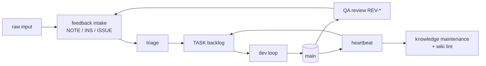

# Lifecycle of a change

How anything — a bug report, an idea, a QA finding, an owner instruction — becomes shipped, verified work and, eventually, maintained knowledge. `work/README.md` is the canonical routing table; this page is the narrative.

## 1. Capture

Raw material enters through `processes/feedback-intake.md`: owner notes, user feedback, and agent observations become `notes/NOTE-*` (raw, never implemented directly), `work/insights/INS-*` (ideas), or `work/issues/ISSUE-*` (reproducible defects). Filing is cheap by design; nothing is acted on at capture time.

## 2. Triage

`processes/triage.md` processes the inbox: insights are accepted (recording `outcome:` task IDs), rejected, or deferred with a revisit trigger — acceptance is a proposal the owner confirms, and confirmation is a deferred grill (`processes/grilling.md`, ADR-008): each promotion ships with the load-bearing questions it rests on, so the owner decides rather than rubber-stamps. Issues get reproduced, confirmed, and assigned severity. Ideas too big for tasks may become epic proposals.

## 3. Specify

Actionable work becomes a `TASK-*` from the template in `work/README.md`: one focused session, objective acceptance criteria, an executable Verification section, provenance kept via `source:`/`research:`. Product-facing tasks carry a Problem brief separating outcome from output. A task needing research runs `processes/deep-research.md` first, landing a `RES-*` file.

## 4. Prioritize

With several candidates, `processes/prioritization.md` ranks them; the heartbeat's "next up" recommendation and blocker issues override. The dev loop's Pick step encodes the order.

## 5. Implement and ship

`processes/dev-loop.md` runs the nine steps: pick → claim (`status: in-progress` is the lock) → plan (logged in the item) → implement in small tested increments → independent review (`processes/code-review.md`) → test (`bun run check` plus the item's Verification, literally executed) → record (criteria ticked honestly, Log written, ADR/LOG.md if shape changed, wiki pages updated if "how it works" changed) → ship (one commit, `TASK-###:` prefix, pushed to `main` per `processes/git-workflow.md` — since TASK-031, following its commit-isolation steps: worktree-per-agent preferred, pathspec staging/commits mandatory in shared trees) → reflect (discoveries filed as insights/issues/notes, never as scope creep). Since TASK-024 (ADR-009), pushing to `main` has a second effect: Cloudflare Workers Builds re-runs `bun run check` and deploys the app to the dev Workers URL — agents ship dev deployments by pushing, but no deploy credential exists anywhere they can reach (it is implicit in the owner-managed Cloudflare↔GitHub connection).

## 6. Observe and close the loop

Every ~5 shipped tasks the heartbeat schedules a QA/product review (`processes/qa-product-review.md`), whose `REV-*` report files fresh insights and issues — feeding step 1 again. Every ~10, a knowledge-maintenance sweep (`processes/knowledge-maintenance.md`) prunes stale items, audits research feed-forward, and lints this wiki against its sources (`processes/wiki-maintenance.md`). The heartbeat ledger (`work/HEARTBEAT.md`) records what was scheduled, skipped, and recommended — so the whole cadence is auditable after the fact.

At any point, the owner can ask for a status report (`processes/status-report.md`). That path does not mutate the tracker: it computes facts from frontmatter and git, then reruns prioritization for fresh advice. It exists because the heartbeat ledger is intentionally historical and can go stale as soon as more tasks ship.
